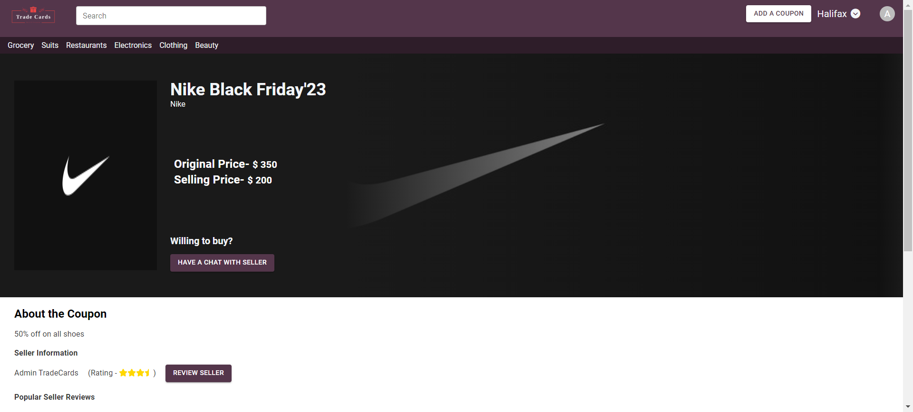
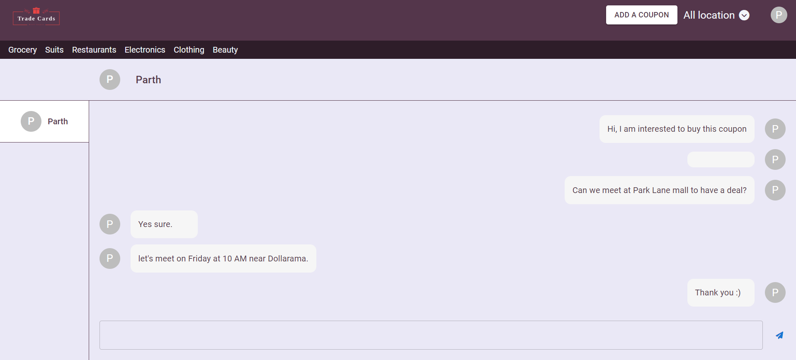

    

  

## Introduction

TradeCards is an innovative platform designed for coupon enthusiasts and savvy shoppers alike. With TradeCards, users can easily sign up, showcase, and sell their coupons, creating a dynamic marketplace for incredible savings. Not only can users browse a diverse array of coupons posted by others, but they can also engage in real-time conversations through our integrated chat feature.

What sets TradeCards apart is the ability for users to seamlessly exchange coupons offline, fostering a sense of community and trust among deal-seekers. To enhance transparency and confidence in transactions, users can leave reviews for sellers, providing valuable insights that future buyers can reference while browsing the platform.

## Screenshots

## Dependencies

List of dependencies used in the project:

### Frontend Pre-requisiste Software

- [Node.js](https://nodejs.org/)
- [npm](https://www.npmjs.com/)

### Backend Pre-requisiste Software

- [Java Development Kit 17 (JDK)](https://www.oracle.com/java/technologies/javase/jdk17-archive-downloads.html)
- [MySQL Workbench](https://www.mysql.com/products/workbench/)
- [Maven](https://maven.apache.org/)

## Installation

### Frontend Installation

Make sure you have Node.js and npm installed.

- cd frontend\tradecards_ui
- npm install

### Backend Installation

- cd backend\tradecards
- mvn clean install

## Backend dependencies

### [Spring Boot](https://spring.io/projects/spring-boot)

- **Version**: 3.1.4
- **Description**: Spring Boot makes it easy to create stand-alone, production-grade Spring-based Applications.

### [MySQL Connector/J](https://dev.mysql.com/downloads/connector/j/)

- **Version**: 8.2.0
- **Description**: Official MySQL driver for Java. Used for connecting to MySQL database.

### [Spring Boot Starter Data JPA](https://spring.io/guides/gs/accessing-data-jpa/)

- **Description**: Starter for using Spring Data JPA with Hibernate for database interaction.

### [Spring Boot Starter Security](https://spring.io/guides/gs/securing-web/)

- **Description**: Starter for using Spring Security for authentication and authorization.

### [Spring Boot Starter Web](https://spring.io/guides/gs/serving-web-content/)

- **Description**: Starter for building web applications with Spring MVC.

### [Spring Boot DevTools](https://docs.spring.io/spring-boot/docs/current/reference/html/using.html#using.devtools)

- **Scope**: Runtime
- **Optional**: true
- **Description**: Provides fast application restarts, among other development-time features.

### [Lombok](https://projectlombok.org/)

- **Optional**: true
- **Description**: Java library that helps reduce boilerplate code in Java classes.

### [Spring Boot Starter Test](https://docs.spring.io/spring-boot/docs/current/reference/html/spring-boot-features.html#boot-features-testing)

- **Scope**: Test
- **Description**: Starter for testing Spring Boot applications with JUnit.

### [JWT (JSON Web Token)](https://github.com/jwtk/jjwt)

- **Version**: 0.9.1
- **Description**: Library for working with JSON Web Tokens.

### [Spring Boot Starter Mail](https://docs.spring.io/spring-boot/docs/current/reference/html/using.html#using.mail)

- **Version**: 3.1.2
- **Description**: Starter for sending email using Spring Framework's JavaMailSender.

### [JAXB API](https://javaee.github.io/jaxb-v2/)

- **Version**: 2.3.1
- **Description**: Java Architecture for XML Binding, used for XML processing.

### [JUnit](https://junit.org/junit4/)

- **Version**: 4.13.2
- **Scope**: Test
- **Description**: Framework for writing and running tests in Java.

## Build Plugins

### [Maven Surefire Plugin](https://maven.apache.org/surefire/maven-surefire-plugin/)

- **Version**: 3.1.2
- **Description**: Maven plugin for running tests.

  - Additional Dependencies:
    - [JUnit Jupiter Engine](https://junit.org/junit5/docs/current/user-guide/#running-tests-build-plugins)

### [Spring Boot Maven Plugin](https://docs.spring.io/spring-boot/docs/current/maven-plugin/reference/htmlsingle/)

- **Description**: Maven plugin for building Spring Boot applications.

  - Configuration:
    - Excludes Lombok during the build.

## How to Build and Run

## Frontend build and run

- npm run build

## Backend build and run

- mvn clean install

  The build artifacts, including the JAR file, will be available in the target directory.
  To deploy the backend of the full-stack web application, follow these steps:

1. **Copy JAR File:**

   Copy the generated JAR file from the `target` directory after the backend build to your deployment environment.
   cp backend/target/tradecards.jar /path/to/deployment/directory

2. **Deploy:**
   java -jar /path/to/deployment/directory/tradecards.jar

### Development Team

Meet the amazing individuals behind TradeCards:

1. **Harshpreet Singh**

   - _Role_: Backend Developer
   - _GitLab_: [@harshpreet](https://git.cs.dal.ca/harshpreet)

2. **Jayrajsinh Mahavirsinh Jadeja**

   - _Role_: Frontend Developer
   - _GitLab_: [@jjadeja](https://git.cs.dal.ca/jjadeja)

3. **Kabilesh Ravi chandran**

   - _Role_: Frontend Developer
   - _GitLab_: [@kchandran](https://git.cs.dal.ca/kchandran)

4. **Parth Pinakin Modi**
   - _Role_: Backend Developer
   - _GitLab_: [@ppmodi](https://git.cs.dal.ca/ppmodi)